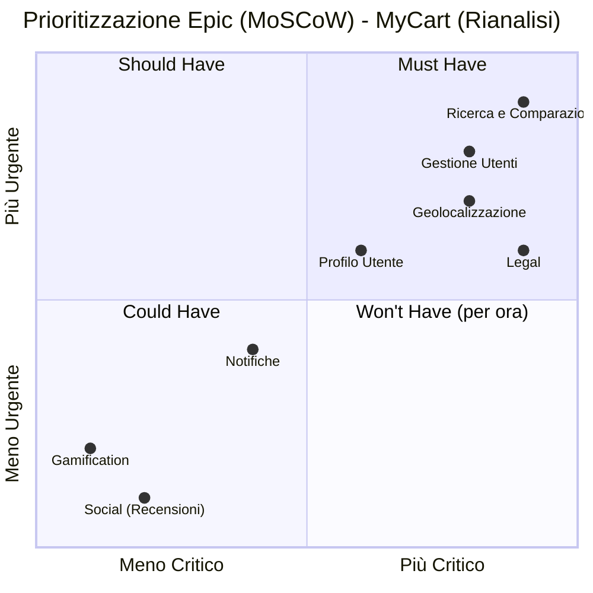

# Grafico MoSCoW delle Epic di Progetto - MyCart

Questo file contiene il codice per generare un diagramma MoSCoW che illustra la priorità delle Epic del progetto.

## Come visualizzare il grafico

Copia e incolla il codice qui sotto in un editor che supporta Mermaid, come:
- **Editor Online Ufficiale Mermaid:** [https://mermaid.live](https://mermaid.live)
- **Visual Studio Code** con l'estensione "Markdown Preview Mermaid Support".
- **GitLab, GitHub** e molte altre piattaforme che renderizzano automaticamente i diagrammi Mermaid all'interno dei file Markdown.

---

